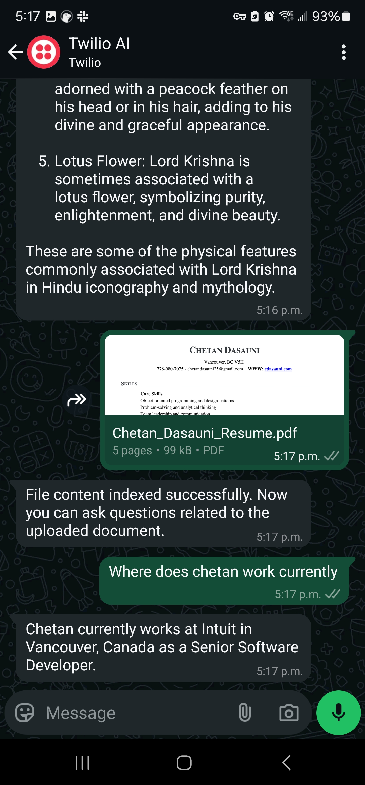
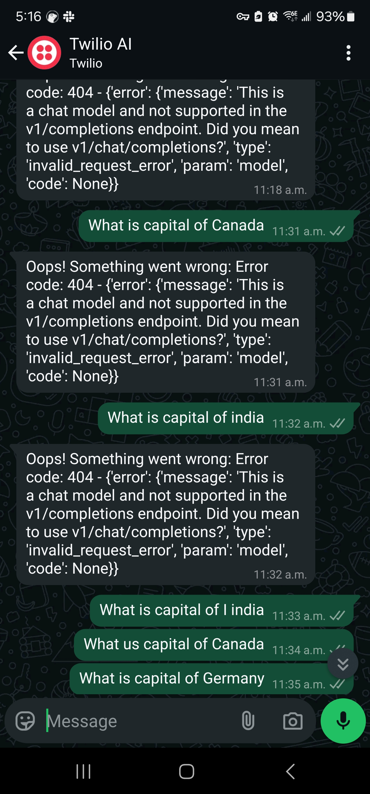

# WhatsApp AI bot with Twilio and Python LangChain

Simple POC using LangChain to built a WhatsApp bot chat with.

## Requirements

- [Twilio Account](https://www.twilio.com/docs/whatsapp/sandbox)
  - Go to Twilio and sign up for a free account.
  - Activate the Twilio Sandbox for WhatsApp
  - Join the Sandbox:
    - Twilio provides a unique WhatsApp number and a code to connect.
    - Add the Twilio-provided WhatsApp number to your WhatsApp contacts.
    - Send the unique code (e.g., join sandbox-code) to the Twilio number from WhatsApp to join the Sandbox.
  - Configure Webhooks for Incoming and Outgoing Messages, URL where Twilio will send incoming messages. We will use the ngrok server endpoint for local testing.
- [ngrok](https://ngrok.com/docs/getting-started/)
  - We will use ngrok for local testing
- [OpenAI account](https://openai.com/)
  - We will use this for the LLM, you can replace it with Ollama if needed.
  - Once u have the account, get the API key and copy the value in the `.env.example`.
  - Now update the `.env.example` to `.env`

## Local Development

- Install the dependencies by running `pip install -r requirement.txt`
- Run the following to start the local ngrok server `ngrok http http://localhost:8080`
- The port 8080 is mapped from your local python server. Copy the url shown in the `Forwarding` in the Twilio console for Whatsapp Webhooks for Incoming and Outgoing Messages.
- Now start the python server `python server.py`

## User flow

- User can interact with the LLM via bot to ask generic questions.
- User can upload pdf to the bot and ask questions around it.

## Code

- The python server exposes an endpoint which Twilio is consuming.
- We are exposing one endpoint for both chat and file upload.

```py

@app.route('/whatsapp/incoming', methods=['POST'])
def whatsapp():
    incoming_msg = request.values.get('Body', '').strip()  # User's WhatsApp message
    incoming_file_url = request.values.get('MediaUrl0')  # File URL if provided

    response = MessagingResponse()
    msg = response.message()

    # Temp config, for prod can ue the incoming number
    config = {"configurable": {"thread_id": "abc123"}}

    try:
        if incoming_file_url:
            file_name: str = handle_file_download(incoming_file_url)
            file_content = extract_text_from_file(file_name)

            # Index the extracted content
            index_document(file_content)

            msg.body("File content indexed successfully. Now you can ask questions related to the uploaded document.")
        else:
            # Use the LangChain agent to handle the user's message
            input_messages = [HumanMessage(incoming_msg)]
            print(f"input_messages: {input_messages}")

            agent_response = agent.invoke({"messages": input_messages}, config)
            ai_response = agent_response["messages"][-1]
            msg.body(str(ai_response.content))
    except Exception as e:
        msg.body(f"Oops! Something went wrong: {e}")

    return str(response)

if __name__ == '__main__':
    # starting the server at 8080
    app.run(port=8080, debug=True)
```

## UI



